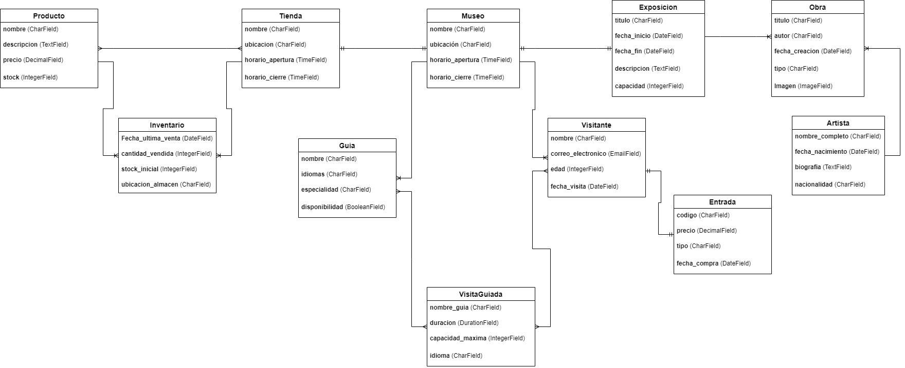

# Aplicacion-Web--Museo
Aplicación Web sobre un museo que se ira desarrollando a lo largo del curso.

Para este proyecto, he elegido una página web de un museo. En esta página, podremos ver información relevante del museo, como sus exposiciones, las obras que están expuestas en él, junto con información sobre sus respectivos autores. También cuenta con guías que se encargarán de realizar diferentes visitas guiadas a los clientes del museo. Por último, también incluye una tienda donde se podrán comprar distintos productos relacionados con el museo o con sus exposiciones.

Modelos de Museo:

Modelo: Museo
nombre (CharField): Nombre del museo
ubicacion (CharField): Dirección del museo
horario_apertura (TimeField): Horario en el que abre el museo
horario_cierre (TimeField): Horario en el que cierra el museo

Modelo: Exposicion
titulo (CharField): Título de la exposición
fecha_inicio (DateField): Fecha de inicio de la exposición
fecha_fin (DateField): Fecha de finalización de la exposición
descripcion (TextField): Detalles de la exposición
capacidad (IntegerField): Cantidad total de personas que pueden asistir

Relación OneToOne con Museo: El museo solo realiza una exposición a la vez.

Modelo: Obra
titulo (CharField): Título de la obra
autor (CharField): Nombre del autor de la obra
fecha_creacion (DateField): Fecha en la que se creó la obra
tipo (CharField): Tipo de obra (escultura, pintura, etc.)
Imagen (ImageField): Foto de la obra

Relación ManyToOne con Exposicion: Una exposición cuenta con varias obras, pero las obras solo pueden estar en una exposición a la vez.

Modelo: Artista
nombre_completo (CharField): Nombre completo del artista
fecha_nacimiento (DateField): Fecha de nacimiento del artista
biografia (TextField): Información sobre el artista
nacionalidad (CharField): Nacionalidad del artista

Relación ManyToOne con Obra: Un artista puede tener varias obras en el museo.

Modelo: Visitante
nombre (CharField): Nombre del visitante
correo_electronico (EmailField): Correo electrónico del visitante
edad (IntegerField): Edad del visitante
fecha_visita (DateField): Fecha de la visita al museo

Relación ManyToOne con Museo: Un museo puede tener varios visitantes, pero un visitante solo puede estar en un museo a la vez.

Modelo: Entrada
codigo (CharField): Código único de la entrada
precio (DecimalField): Precio de la entrada
tipo (CharField): Tipo de entrada (adulto, niño, etc.)
fecha_compra (DateField): Fecha en la que se compró la entrada

Relación OneToOne con Visitante: Cada entrada es comprada por un único visitante

Modelo: Tienda
nombre (CharField): Nombre de la tienda del museo
ubicacion (CharField): Ubicación de la tienda dentro del museo
horario_apertura (TimeField): Hora de apertura de la tienda
horario_cierre (TimeField): Hora de cierre de la tienda

Relación OneToOne con Museo: Cada museo sólo tiene una tienda específica

Modelo: Producto
nombre (CharField): Nombre del producto
descripcion (TextField): Descripción del producto
precio (DecimalField): Precio del producto
stock (IntegerField): Cantidad disponible en la tienda

Relación ManyToMany con Tienda (con tabla intermedia): Varios productos pueden estar en una o varias tiendas.

Modelo: Inventario
cantidad_vendida (IntegerField): Cantidad del producto vendida.
fecha_ultima_venta (DateField): Fecha de la última venta.
stock_inicial (IntegerField): Cantidad inicial del producto en el inventario.
ubicacion_almacen (CharField): Ubicación en el almacén donde se encuentra el producto.

Relación: Inventario será una tabla intermedia entre Tienda y Producto, ya que relaciona la cantidad de productos vendidos en la tienda y otros detalles. Tendrá una relación ManyToOne con Producto y otra ManyToOne con Tienda.

Modelo: Guia
nombre (CharField): Nombre del guía
idiomas (CharField): Idiomas que habla
especialidad (CharField): Que tipo de arte ha estudiado
disponibilidad (BooleanField): Indica si está disponible para una visita guiada

Relación ManyToOne con Museo: Varios guías trabajan en un museo específico

Modelo: Visita guiada
duracion (DurationField): Duracion de la visita
nombre_guia (CharField):  Nombre del guia que la imparte
capacidad_maxima (IntegerField): Número máximo de visitantes que pueden unirse a la visita guiada.
idioma (CharField): Idioma en el que se realiza la visita (por ejemplo, español, inglés).

Relación ManyToMany con Visitante: Varios visitantes pueden asistir a varias visitas guiadas.

Relaciones Resumidas:

OneToOne:
Tienda ↔ Museo 
Visitante ↔ Entrada
Exposición ↔ Museo 
ManyToOne:
Visitante →  Museo
Obra → Exposición 
Obra → Artista
Guia →  Museo
ManyToMany:
Guia ↔  Visita_guiada 
Visitante ↔ Visita_guiada 
Tienda ↔ Producto (con tabla intermedia) 

URLs del proyecto:

1- Listado de Museo: Crear una URL que liste todos los datos de museo.

Usamos prefetch_related en lugar de select_releted porque.
Esto tambien estaria usando una relación reversa.

2- Listado de Exposiciones por año: Crear una URL que muestre una lista de todas las exposiciones para un año concreto.

Usa una relacion reversa al acceder a las obras de cada exposición y a sus artistas.

3- Listado de Obras de un artista específico que se encuentren en una exposición concreta.

Filtro AND y dos parametros en la URL.

4- Listado de visitantes con una edad mayor a un número concreto, ordenados alfabéticamente.

Usamos un parametro entero, filtro y gt para sacar las edades superiores. También el order by para ordenar el resultado.

5- Listado de artistas con nacionalidad española, ordenados por fecha de nacimiento descendente.

Usamos un filtro y un parametro de tipo str.

6- Listado de guias que hablen francés o inglés.

Usamos dos parametros y el filtro OR. Al usar un filtro OR debemos usar Q y | para este tipo de filtros. La Q se usa como condicional y la | indicar que solo se necedita que se cumpla una de las dos condiciones.
Usamos icontains en el filtro para que el idioma coincida parcialmente, permitiendo búsquedas como "francés" o "inglés" sin distinguir entre mayúsculas, minúsculas o palabras tildadas.

7- Media del precio de los productos que se venden en la tienda.

Usamos aggregate para generar un atributo nuevo.
Para sacar la media usamos la función Avg, que viene de average en ingles, nos permite saber la media aritmética de un conjutno de valores.

8 - Primer visitante que acudio al museo en 2023.

Usamos un limit para sacar solo 1 [:1] y con un order by por fecha_visita sacamos al prmer visitante de ese año. Podríamos sacar el último añadiendo un "-" al parametro de "fecha_visita" del order_by

9 - Productos que aún no se hayan vendido.

Filter con la tabla intermedia de inventario, que es la que guarda la fecha de la ultima venta.
Debemos filtrar por la "fecha_ultima_venta" y no por la cantidad vendida porque de fecha si que tenemos un valor null, compatible con la condición de None
Este filtro nos mostrará los productos que no tienen una ultima fecha de venta, por lo cual, nunca se han vendido.

10 - Visitantes que se encuentren por debajo de la media de edad de todos los visitantes del museo.

Usamos la combinación de un filtro y un aggregate, con el aggregate sacamos la media de la edad de los visitantes y lo guardamos en el atributo "edad_media"
Ahora solo debemos aplicar un filtro a ese atributo de aggregate. Para ello usamos filter el atributo de edad, seguido de lt para indicar los que sean menores a la media, y lo igualamos al atributo de "edad_media".

   **Templates usados del proyecto:**

1. **`` y ``**:  
   - Usados en `artista_nacionalidad.html`, `exposicion_anyo.html`, `obra_artista_exposicion.html`, `primer_visitante_2023.html`, `guia_nacional.html` para manejar condiciones y mostrar el número de resultados que devolvía.

2. **``**:  
   - Usados en `artista_nacionalidad.html`, `exposicion_anyo.html`, `guia_nacional.html`, `lista.html`, `obra_artista_exposicion.html`, `precio_medio.html`, `productos.html`, `visitaguiada_visitantes_media.html`, `primer_visitante_2023.html`, `visitante_edad.html` y `visitante_menor_media.html` para mostrar mensajes cuando no hay elementos en la lista.

3. **``**:  
   - Usado en todas las plantillas de lista (`artista_nacionalidad.html`, `exposicion_anyo.html`, `guia_nacional.html`, `lista.html`, `obra_artista_exposicion.html`, `precio_medio.html`, `productos.html`, `visitaguiada_visitantes_media.html`, `primer_visitante_2023.html`, `visitante_edad.html`, `visitante_menor_media.html` y `principal.html`) para incluir plantillas parciales.

4. **``**:  
   - Usado en `principal.html` y usado en todas las plantillas para personalizar secciones.

5. **`` **:  
   - Usados en `principal.html` para cargar archivos estáticos de la carpeta static, como el css, javascript y el logo.

   **Operadores usados en el proyecto**

1. **Operador de comparación (`>=`)**:
   - Usado en `obra_artista_exposicion.html` y `visitante_edad.html` para comprobar si un valor es mayor o igual que otro.

2. **Operador de comparación (`<`)**:
   - Usado en `visitante_edad.html` para comprobar si un valor es menor que otro.

3. **Operador lógico (`and`)**:
   - Usado en `visitante_edad.html` para realizar una comparación que debía cumplir dos condiciones.

4. **Operador de pertenencia (`in`)**:
   - Usado en `artista_nacionalidad.html`, `exposicion_anyo.html`, `guia_nacional.html`, `lista.html`, `obra_artista_exposicion.html`, `precio_medio.html`, `productos.html`, `visitaguiada_visitantes_media.html`, `primer_visitante_2023.html`, `visitante_edad.html` y `visitante_menor_media.html` .Comprobamos si un valor está en una lista.

5. **Operador lógico (`not`)**:
   - Usado en `primer_visitante_2023.html` para negar una variable de una condición.

   **Filtros usados en el proyecto**

1. **date** 
   - Formatea fechas según el formato que le pasemos. Ejemplo: {{ fecha|date:"d/m/Y" }}. Usado en `_artista.html`, `_exposicion_.html`, `_museo.html`, 
   `_obra.html`, `_visitante.html`

2. **capfirst** 
   - Convierte en mayúscula la primera letra del valor. Usado en `_obra.html`

3. **yesno**
   - Convierte valores booleanos (True/False/None) al texto predeterminado que le pasemos, el primero será True, el segundo False y el tercero None. Usado en `_guia_.html`, 

4. **floatformat** 
   - Redondea números decimales según el número de decimales que indiquemos. Usado en `precio_medio.html`, `visitante_menor_media.html`

5. **length**
   - Devuelve la longitu del valor que le pasemo (número de caracteres en un string o elementos en una lista). Usado en `artista_nacionalidad.html`, `exposicion_anyo.html`, `guia_nacional.html`, `obra_artista_exposicion.html`

6. **title**
   - Convierte el texto a formato título, poniendo en mayúscula la primera letra de cada palabra. Usado en `_guia_.html`

7. **urlize**
   - Convierte texto plano que contiene URLs en enlaces. Usado en `_visitante.html`

8. **deafult**
   - Devuelve un valor predeterminado si el valor original es vacío o None. Usado en `_producto.html`

9. **add**
   - Suma un valor numérico al valor original. Usado en `_exposicion_.html`

10. **cut**
   - Elimina todas las apariciones de un valor específico, que le indiquemos, en el texto. Usado en `_visitante.html`

Crear, actualizar y borrar por Post, leer por Get
Orden para crear formularios: La url, el formulario, la vista y el template.